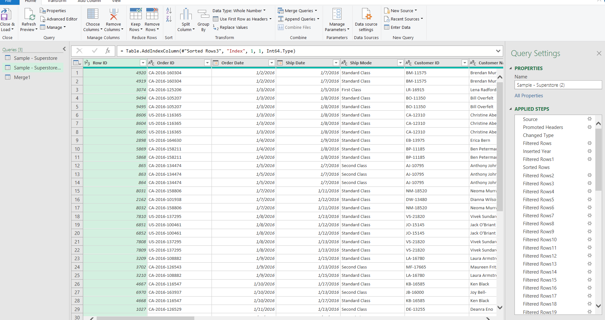
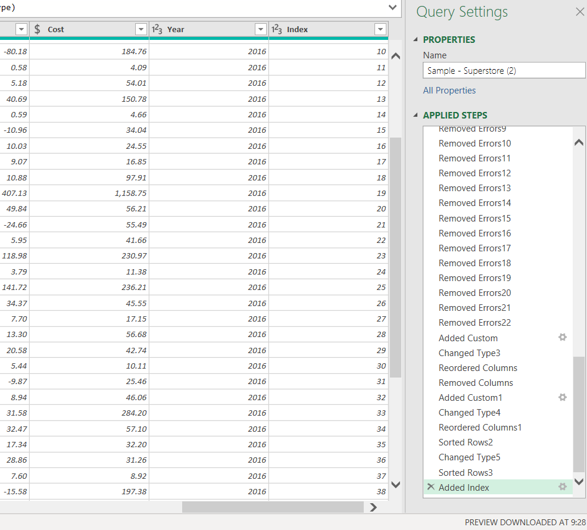
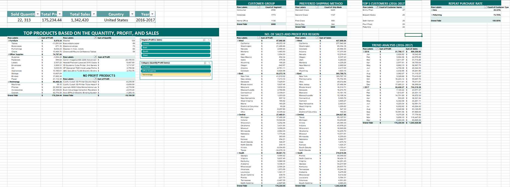
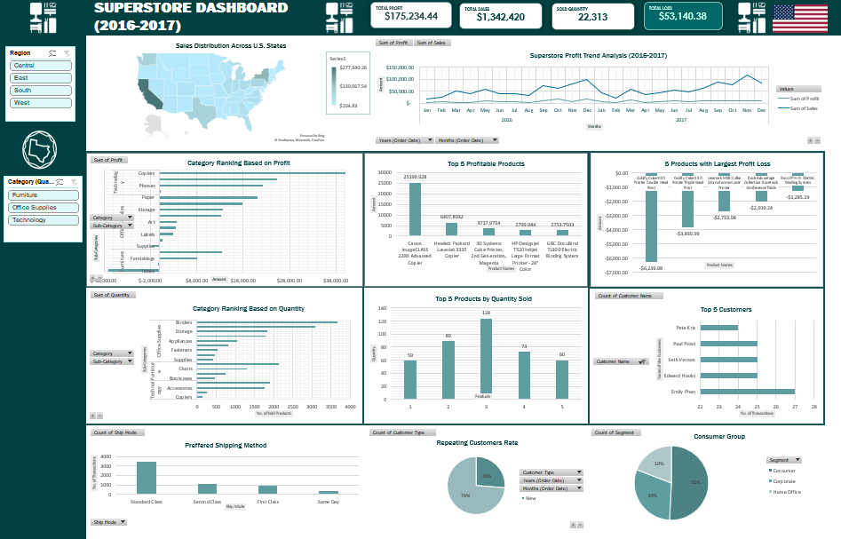

# Superstore-Excel-Project

## Objective

For this project, I utilized excel and showcase my knowledge and proficency with its tools.I answered the common business questions using my downloaded datasets and perform basic data analysis to come up with the result and created dashboards using **Excel** based on the aggregated data.

 ### Business Questions
1. Which region achieved the highest total profit and sales? 
2. Which month recorded the highest sales during the 2016–2017 period?
3. How many products were sold in each category and sub-category, and which performed best?
4. How do profit and sales compare across categories, and which categories show the strongest or weakest performance?
5. Which five products generated the highest profit and quantity volume?
6. Who are the top five customers based on total quantity purchased?
7. Which customer segment and shipping method contribute most to overall business performance?
8. What percentage of total customers are new versus returning?
9. How much did the company lose, and which five products contributed most to the loss?
10. What are the company’s total quantity sold, total sales, total losses, and total profit?

## Dataset Used
This project obtained the dataset from **Kaggle**. You can check on this link: https://www.kaggle.com/datasets/vivek468/superstore-dataset-final

## Step 1: Data Cleaning
In this step, I loaded the CSV files and transformed it using Power Query. 

The specific steps that I performed in data cleaning are:
1. Separate Year of Order Date.
2. Sort and filter data in the query ascending from 2016-2017.
3. Filter/delete empty rows.
4. Remove unecessary duplicates and errors.
5. Format data.

For additional information, I added some few columns which was higlighted in blue on the sheet.

6. Adding column for a Cost and performed a formula ``=[Profit]- [Sales]`` (additional data but not necessary on BQ's).
7. Merging grouped table to identify whether each customer transaction comes from new/returning customers.

## Step 2: Data Aggregation/Transformation
After completing the data cleaning process, I created a new worksheet in Excel specifically for data aggregation and transformation. This step focuses on summarizing, organizing, and restructuring the cleaned dataset to make it easier to analyze and visualize later.

## Step 3: Data Analysis

For the data analysis, I observed the results coming from the pivot tables and utilized the filter features to simplify the table and lead to the most accurate result.

* Compared other regions to understand performance disparities
* Observed seasonal patterns or spikes in sales, providing insights into peak business periods
* Compared sales and profit across categories to identify the strongest and weakest performers.
* Calculated metrics such as profit margin to evaluate which products contributed most to revenue efficiency.
* Used PivotTables with negative profit values and filter to highlight underperforming products.

## Step 4: Dashboard

After completing the analysis, I created charts and moved it into a new sheet to create a dahsboard.

